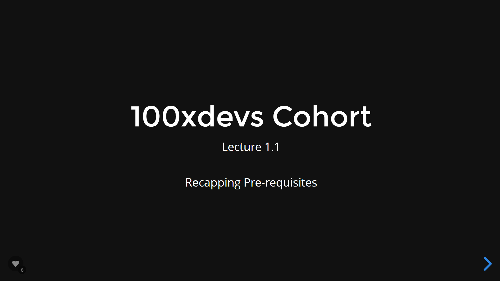
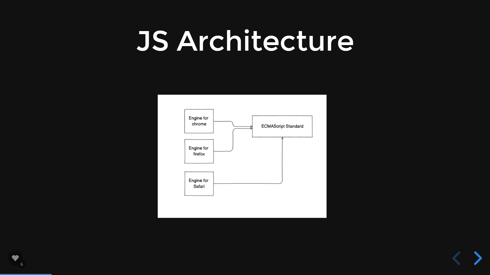
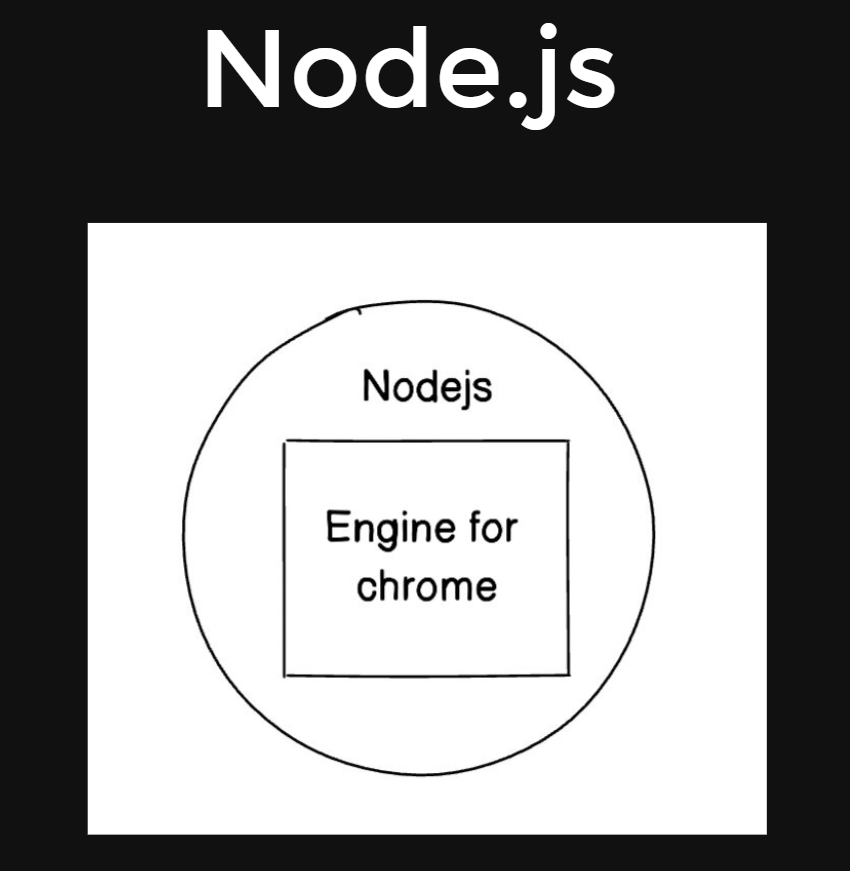
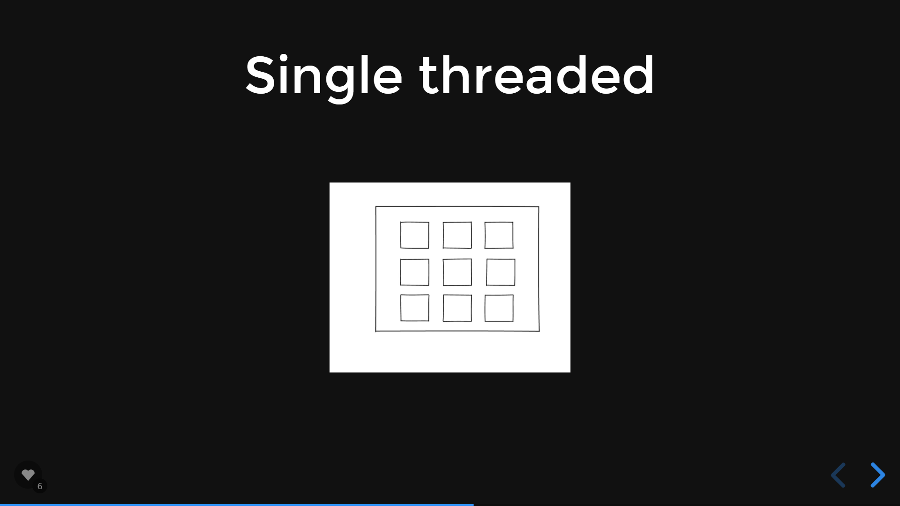
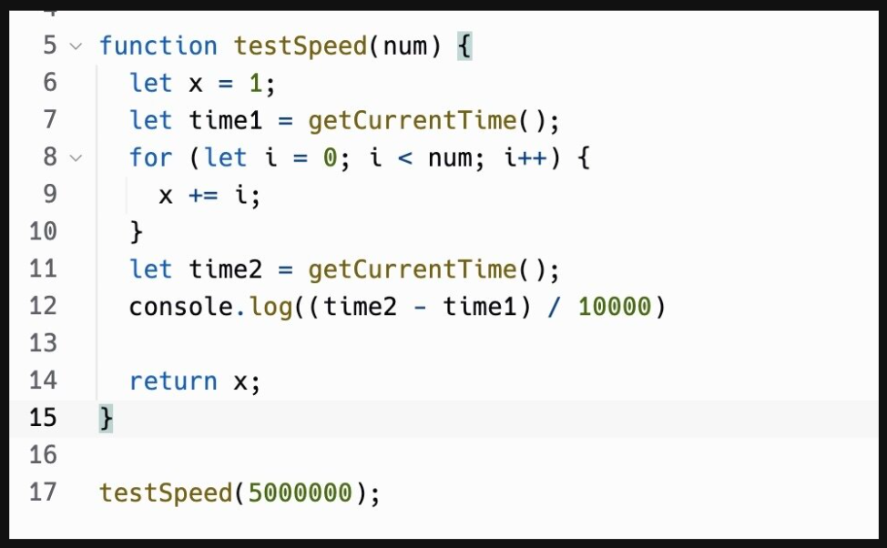
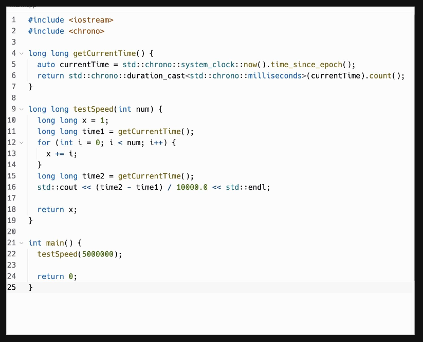

# 100x Dev Cohort 1st Class

https://slides.com/harkiratsingh-3/100xdevs-cohort

## Java Script Architecture 

## Node JS 

## Java Script Primitives

* Variables
    * numbers
    * strings
    * arrays
* Loops
    * For
    * while
* Functions (Primitive, callbacks)
* APIs (Native vs Web)

## Simple program 
* Sum from 1to 100
* Fibonacci Series
* Pattern Creation 

## Checkpoint
* Can we write basic code in JavaScript
* Do we understand Data Variables /structures in JS 

## Java Script is ->
* Single threaded
* Asynchronous
* Loosely typed
* Interpreted
* Native JS vs APIs

## Where can JS run
* Browser
* Data centers
* Flight TV
* Mobile devices

## Single Threaded

## 
https://replit.com/@HarkiratSingh4/WorrisomeScrawnyStatistic#break.js

## Asynchronous
Simple code  vs Complex asynchronous tasks

## Quiz / exercises 
* Simple code vs Complex asynchronous tasks
* Program that calculates sum from 1-100
* Program that generates a pattern
* Program that writes to a file
* Program that does an HTTP API call

## Loosely typed

## Strongly typed

## Interpreted 

## Native JS 
* var x =2;
* for loops
* Date()
* https://262.ecma-international.org/9.0/#sec-numbers-and-dates

## APIS
* Exposed by the runtime environment
* fetch
* setTimeout
* setInterval

